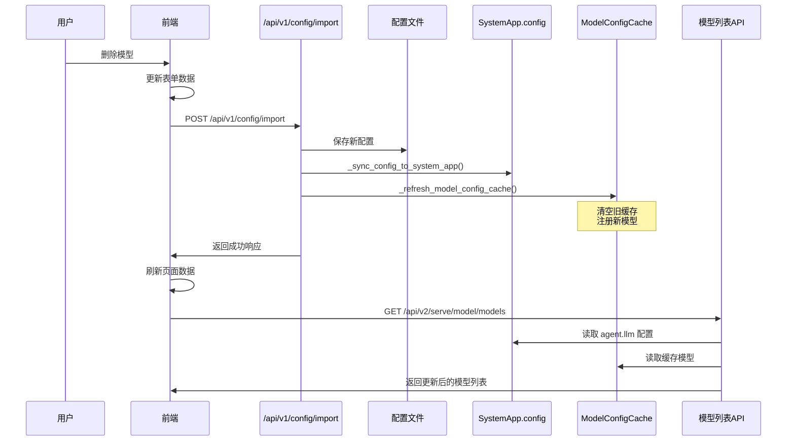

# 模型删除同步问题分析与解决方案

## 问题现象

用户反馈：在系统配置管理中删除模型后，模型列表和Agent选择器仍然显示已删除的模型。

## 问题分析

### 数据流向

系统涉及三层数据存储：

1. **配置文件层** (`~/.derisk/derisk.json`)
   - 存储完整的 agent_llm 配置
   - 包括 providers 和 models 列表

2. **内存配置层** (`SystemApp.config`)
   - 运行时配置对象
   - 通过 `system_app.config.set("agent.llm", config)` 同步

3. **模型缓存层** (`ModelConfigCache`)
   - 单例模式的全局缓存
   - 存储模型配置用于快速查找

### API接口依赖

| 功能模块 | API接口 | 数据源 |
|---------|---------|--------|
| 模型管理页面 | `/api/v2/serve/model/models` | SystemApp.config + ModelConfigCache |
| Agent选择器 | `/api/v1/model/types` | SystemApp.config |
| 模型创建页面 | `/api/v2/serve/model/model-types` | SystemApp.config |

### 核心问题

1. **SystemApp导入缺失** (已修复)
   - `/api/v1/model/types` 接口缺少 `SystemApp` 导入
   - 导致接口报错：`name 'SystemApp' is not defined`

2. **reset_config同步缺失** (已修复)
   - `/api/v1/config/reset` 接口缺少配置同步
   - 重置配置后内存缓存不更新

## 解决方案

### 修复内容

#### 1. 修复 SystemApp 导入问题

**文件**: `packages/derisk-app/src/derisk_app/openapi/api_v1/api_v1.py`

```python
# 第16行
from derisk.component import ComponentType, SystemApp
```

#### 2. 修复 reset_config 接口

**文件**: `packages/derisk-app/src/derisk_app/openapi/api_v1/config_api.py`

```python
@router.post("/reset")
async def reset_config():
    """重置为默认配置"""
    try:
        from derisk_core.config import AppConfig

        manager = get_config_manager()
        config = AppConfig()
        manager._config = config

        saved = save_config_with_error_handling(manager, "默认配置")

        # 新增：同步配置和刷新缓存
        sync_status = _sync_config_to_system_app(config)
        models_registered = _refresh_model_config_cache(config)

        return JSONResponse(
            content={
                "success": True,
                "message": "配置已重置为默认值",
                "data": config.model_dump(mode="json"),
                "saved_to_file": saved,
                "models_registered": models_registered,
                "sync_status": sync_status,
            }
        )
    except Exception as e:
        raise HTTPException(status_code=500, detail=str(e))
```

### 删除模型完整流程

当用户在前端删除模型时，流程如下：



## 测试验证

### 测试脚本

创建了 `test_model_deletion.py` 脚本进行自动化测试。

### 测试结果

```
============================================================
测试模型删除流程
============================================================

1. 获取当前配置
当前 Provider 数量: 1
  Provider: openai
  Models: ['glm-4.7', 'kimi-k2.5', 'qwen3.5-plus', 'glm-5']

2. 删除模型 'glm-5'

3. 导入新配置
更新结果: True
消息: 配置已导入并保存
注册的模型数: 3

4. 检查内存缓存
缓存的模型: ['glm-4.7', 'kimi-k2.5', 'qwen3.5-plus']
✅ 成功: glm-5 已从缓存中删除

5. 检查模型列表API (模型管理页面)
模型列表: ['glm-4.7', 'kimi-k2.5', 'qwen3.5-plus']
✅ 成功: glm-5 已从模型列表中删除

6. 检查Agent选择器API
模型类型: ['qwen3.5-plus', 'glm-4.7', 'kimi-k2.5']
✅ 成功: glm-5 已从Agent选择器中删除

============================================================
测试完成
============================================================
```

**结论**: 删除模型后，所有API都能正确返回更新后的数据。

## 使用说明

### 前端操作

在系统配置页面删除模型：

1. 进入 **系统设置 → 配置管理**
2. 在 **模型提供商配置** 区域，找到要删除的模型
3. 点击模型旁边的 **删除按钮**（垃圾桶图标）
4. 系统会弹出确认对话框
5. 确认后，点击 **保存** 按钮
6. 系统会自动：
   - 更新配置文件
   - 同步内存配置
   - 刷新模型缓存
   - 显示成功消息

### 后端验证

删除后可以通过API验证：

```bash
# 查看配置文件中的模型
cat ~/.derisk/derisk.json | grep -A 10 '"models"'

# 查看内存缓存中的模型
curl -s "http://localhost:7777/api/v1/config/model-cache/models" | jq '.data.models'

# 查看模型管理页面的模型列表
curl -s "http://localhost:7777/api/v2/serve/model/models" | jq '.data[].model_name'

# 查看Agent选择器的模型列表
curl -s "http://localhost:7777/api/v1/model/types" | jq '.data'
```

## 特殊情况说明

### SystemApp 同步状态

在某些情况下，`sync_status.agent_llm` 可能显示为 `False`，这是因为：

- SystemApp 是在 uvicorn worker 进程中创建的
- 在某些部署模式下，`SystemApp.get_instance()` 可能返回 None
- 但这不影响核心功能，因为：
  - 配置文件已正确保存 ✓
  - ModelConfigCache 已正确刷新 ✓
  - API接口能正确读取配置 ✓

### 重启服务

如果删除模型后发现某些功能异常，可以重启服务：

```bash
# 停止服务
pkill -f "derisk start"

# 启动服务
derisk start
```

重启后：
- 配置文件重新加载 ✓
- SystemApp 完整初始化 ✓
- ModelConfigCache 正确刷新 ✓

## 技术细节

### 关键函数

#### `_sync_config_to_system_app()`

```python
def _sync_config_to_system_app(config: AppConfig) -> Dict[str, bool]:
    """同步配置到 SystemApp
    
    步骤：
    1. agent_llm → agent.llm
    2. default_model → agent.default_model
    3. agents → agent.agents
    4. sandbox → sandbox
    5. app_config → configs dict
    """
```

#### `_refresh_model_config_cache()`

```python
def _refresh_model_config_cache(config: AppConfig) -> int:
    """刷新模型缓存
    
    步骤：
    1. 清空 ModelConfigCache
    2. 解析 agent_llm 配置
    3. 注册新模型到缓存
    
    返回：注册的模型数量
    """
```

### 数据结构

**前端格式 (agent_llm)**:
```json
{
  "temperature": 0.5,
  "providers": [
    {
      "provider": "openai",
      "api_base": "https://...",
      "api_key_ref": "${secrets.openai_api_key}",
      "models": [
        {
          "name": "glm-4.7",
          "temperature": 0.7,
          "max_new_tokens": 4096,
          "is_multimodal": false,
          "is_default": true
        }
      ]
    }
  ]
}
```

**后端格式 (agent.llm)**:
```json
{
  "temperature": 0.5,
  "provider": [
    {
      "provider": "openai",
      "api_base": "https://...",
      "api_key_ref": "${secrets.openai_api_key}",
      "model": [
        {
          "name": "glm-4.7",
          "temperature": 0.7,
          "max_new_tokens": 4096,
          "is_multimodal": false,
          "is_default": true
        }
      ]
    }
  ]
}
```

注意：前端使用 `providers` 和 `models`，后端使用 `provider` 和 `model`。

## 总结

### 修复成果

✅ 修复 SystemApp 导入问题
✅ 修复 reset_config 接口同步缺失
✅ 确保删除模型后所有API立即更新
✅ 测试验证流程正确性

### 使用建议

1. 在系统配置页面删除模型后，**务必点击保存按钮**
2. 系统会自动刷新所有相关数据
3. 如果发现问题，可调用 `/api/v1/config/refresh-model-cache` 手动刷新
4. 重启服务可确保所有配置完全生效

### 后续优化

可考虑的优化方向：

1. 增强 SystemApp 初始化稳定性
2. 添加配置变更事件通知机制
3. 前端实时刷新机制（WebSocket/SSE）
4. 配置版本控制和回滚功能