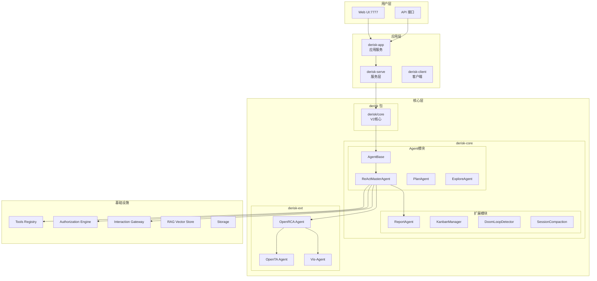
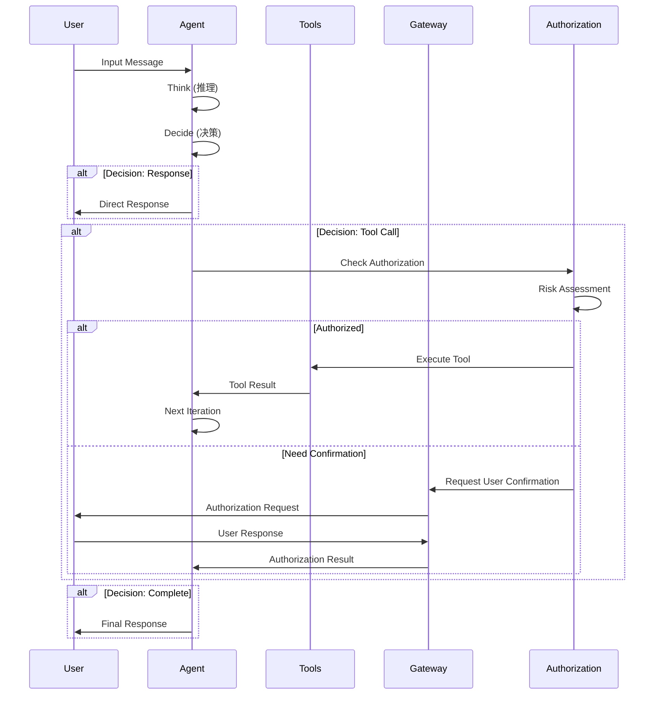
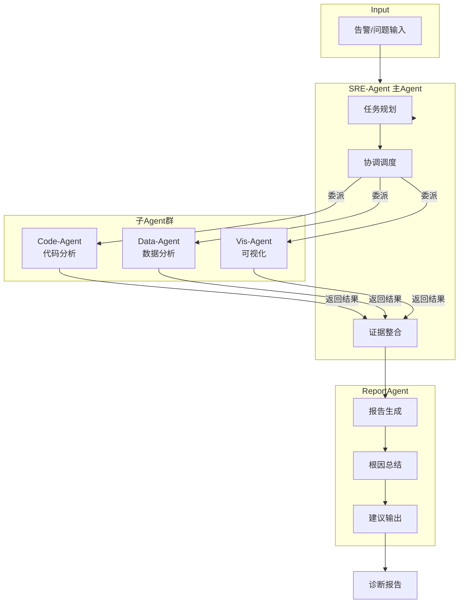
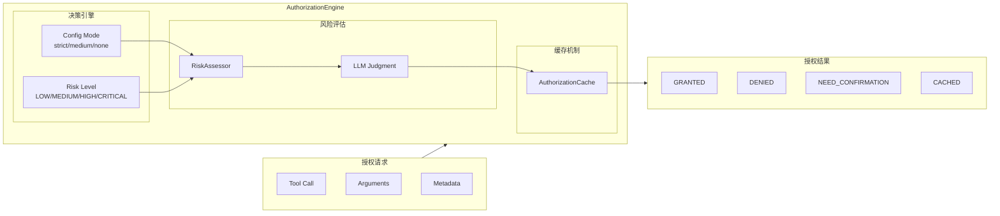
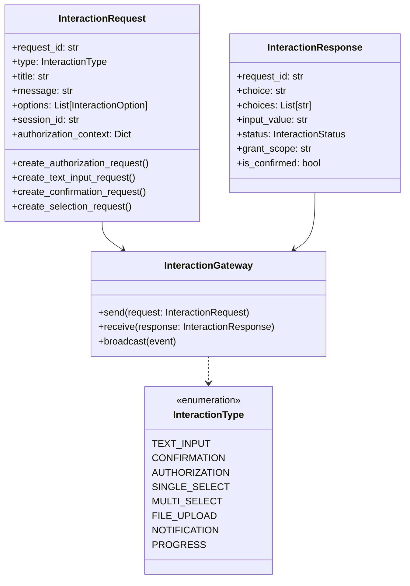
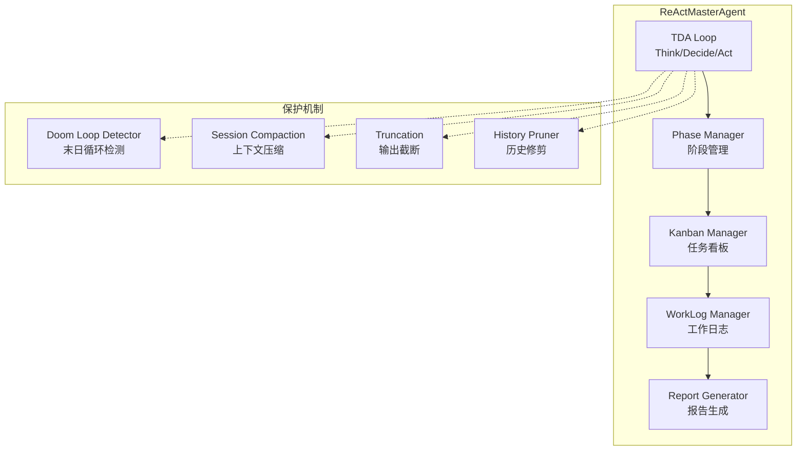
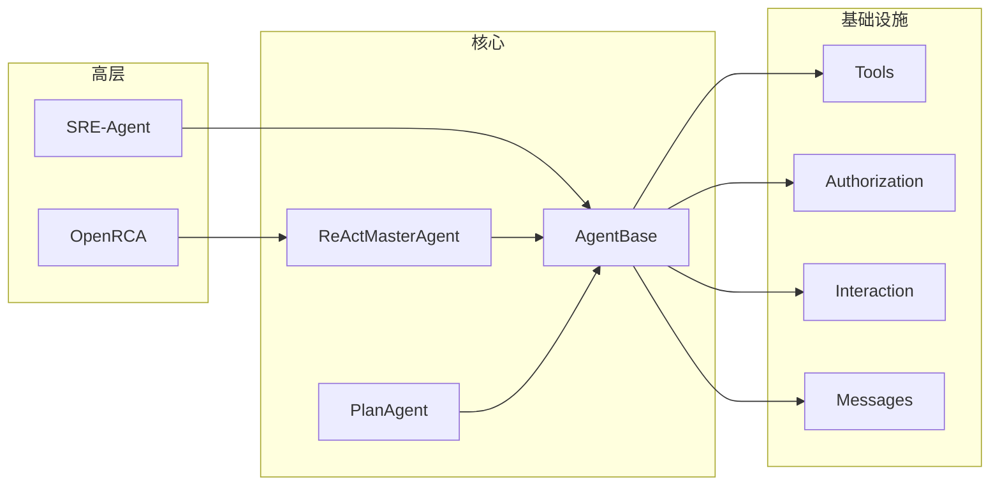
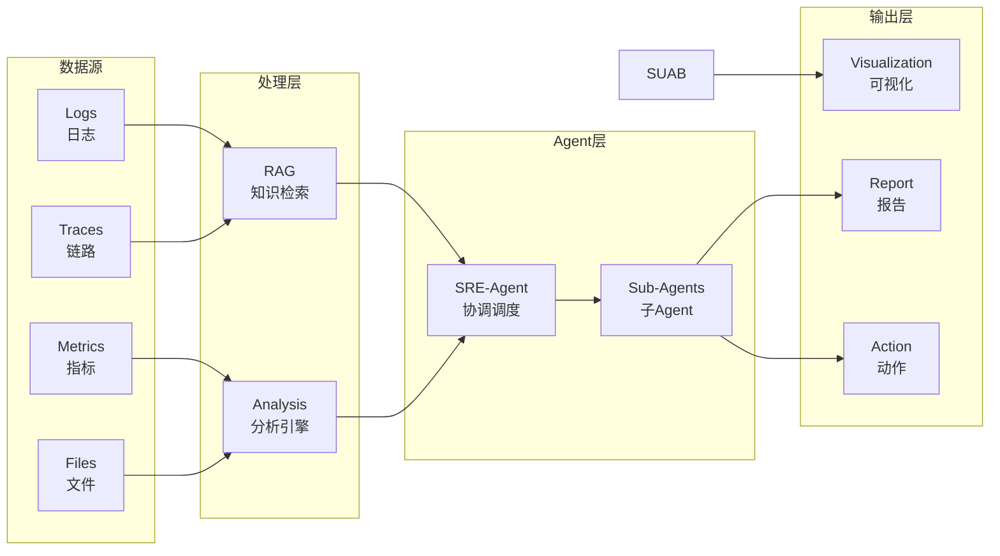

# OpenDerisk 项目架构图 (Mermaid版本)

## 1. 项目整体架构

## 2. Agent TDA 循环

## 3. 多智能体协作

## 4. 授权系统架构

## 5. 交互协议

## 6. ReActMasterAgent 核心组件

## 7. 模块依赖关系

## 8. 数据流架构

---
*使用说明: 可以将这些 Mermaid 代码复制到支持 Mermaid 的编辑器中查看可视化图表，如:*
- *VS Code: 安装 Mermaid 插件*
- *在线: https://mermaid.live/*
- *GitHub README: 原生支持 Mermaid 语法*
